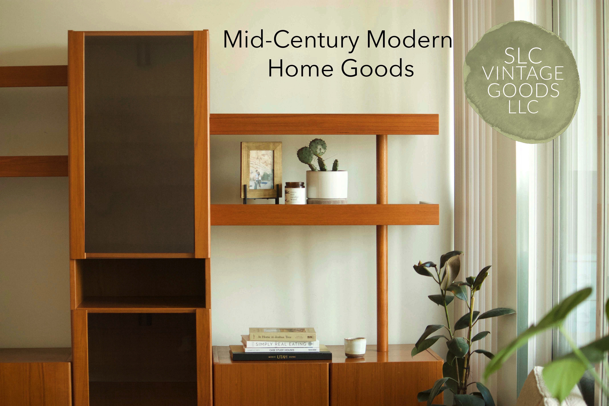
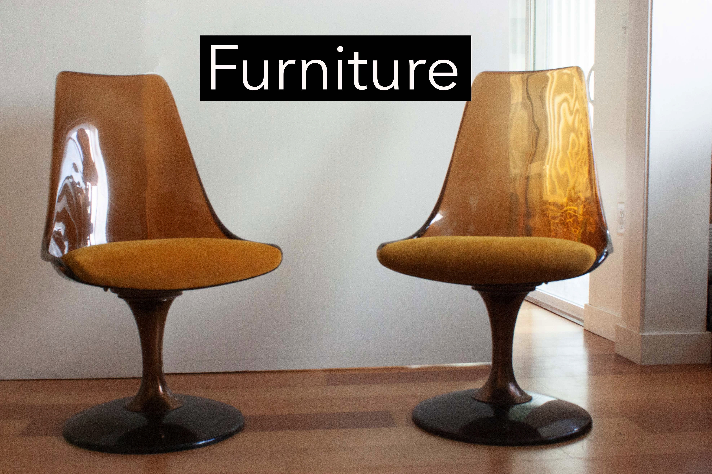
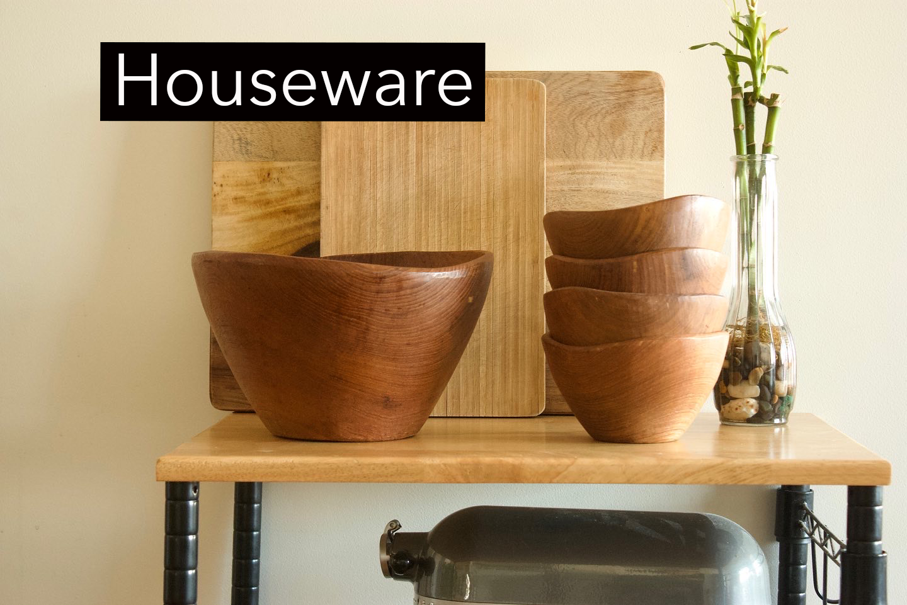
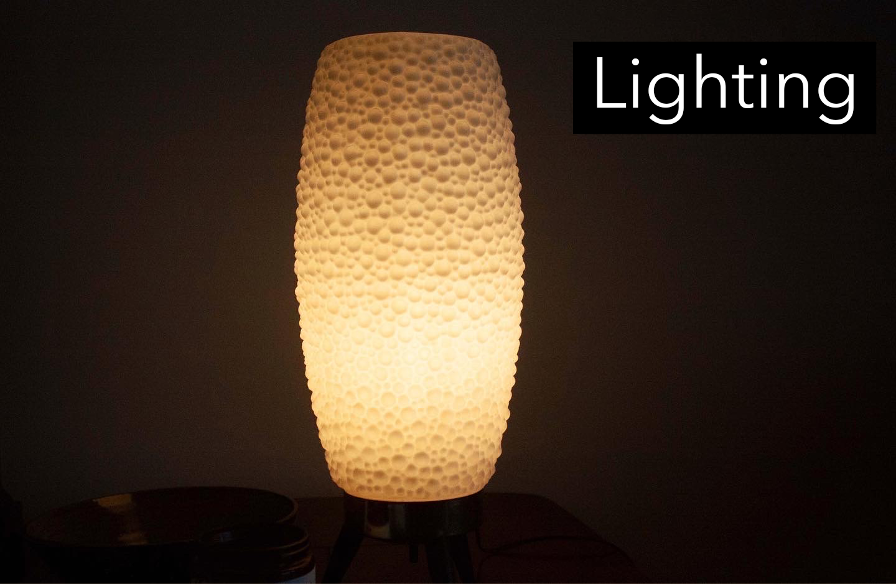
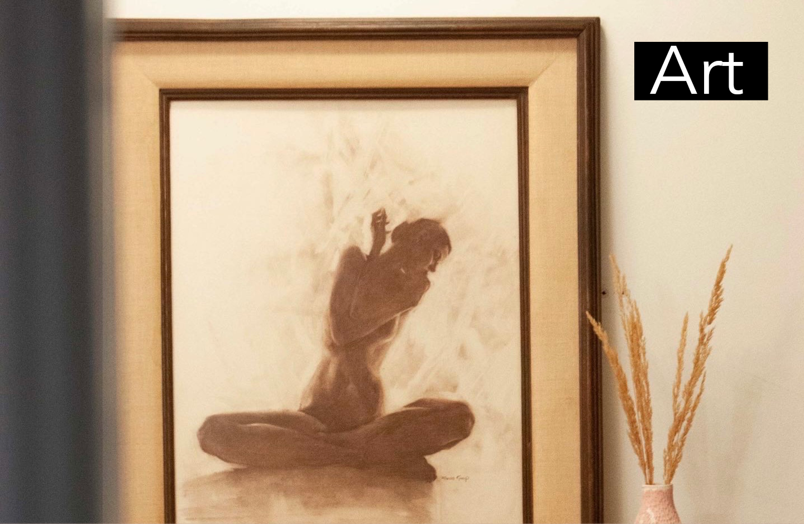

<style type="text/css">
  body{
  background-color: #F6F5E8;
  font-size: 14pt;
}
.box {
  height: 100%;
  width: 100%;
  background-color: #f5f5f0;
  color: black;
  padding: 10px;
  border: solid 1px #d4c496;
}
.box1 {
  height: 75%;
  width: 75%;
  background-color: #F6F5E8;
  color: black;
  padding: 10px;
}
.icon-a {
    color: #FFF;
    background: #ed7732;
    border-radius: 2px;
    padding: 3px;
    font-size: 0.8em;
}
</style>

```{css, echo = FALSE}
@import url(https://fonts.googleapis.com/css?family=Montserrat:400,700);

body { background: #F6F5E8; font-size: 14pt;}
form { max-width:420px; margin:10px auto; }

.feedback-input {
  color:black;
  font-family: Helvetica, Arial, sans-serif;
  font-weight:500;
  font-size: 18px;
  border-radius: 5px;
  line-height: 22px;
  background-color: #FEFEFB;
  border:1px solid #899566;
  transition: all 0.3s;
  padding: 13px;
  margin-bottom: 15px;
  width:100%;
  box-sizing: border-box;
  outline:0;
}

.feedback-input:focus { border:1px solid #B1BF88; }

textarea {
  height: 150px;
  line-height: 150%;
  resize:vertical;
}

[type="submit"] {
  font-family: 'Montserrat', Arial, Helvetica, sans-serif;
  width: 100%;
  background:#B1BF88;
  border-radius:50px;
  border:0;
  cursor:pointer;
  color:black;
  font-size:24px;
  padding-top:10px;
  padding-bottom:10px;
  transition: all 0.3s;
  margin-top:-4px;
  font-weight:700;
}
[type="submit"]:hover { background:#899566; }
.icon-a {
    color: #FFF;
    background: #ed7732;
    padding: 3px;
    font-size: 0.8em;
}
```



```{css toc-content, echo = FALSE}
.main-container {
    max-width: 1800px;
}
```
<div class="box">

<center>
[{width=49%}](AvailableFurniture.html)
[{width=49%}](AvailableHouseware.html)
</center>
<center>
[{width=49%}](AvailableLighting.html)
[{width=49%}](AvailableArt.html)
</center>

<link href="_site/Contact.html"/>

</div>

<br>

<center>
<div class="box1">

<center><font size="5"><b>Let's Chat!</b></font></center>

<form action="https://formspree.io/f/xnqyzvnl" method="POST"> 
  <input name="name" type="text" class="feedback-input" placeholder="Name" />   
  <input name="email" type="text" class="feedback-input" placeholder="Email"/>
  <input name="item" type="text" class="feedback-input" placeholder="Item (if applicable)" />
  <textarea name="text" class="feedback-input" placeholder="Message"></textarea>
  <input type="submit" value="SEND"/>
</form>

</div>
</center>

***

<center><font size="3">
Salt Lake City, UT &nbsp; | &nbsp;
(760) 625-5431 &nbsp; | &nbsp;
slc.vintagegoods@gmail.com 
</font>
<br>

<font size="5">
<a href="https://www.instagram.com/slc.vintagegoods/" class="fa fa-instagram" style="color:black"></a>&nbsp;&nbsp;
<a href="https://www.pinterest.com/adrianaacastilllo/" class="fa fa-pinterest" style="color:#f22c2c"></a>&nbsp;&nbsp;
<a href="https://www.etsy.com/shop/SLCVintageGoods/" class="fa fa-etsy icon-a"></a></font>
</center>

